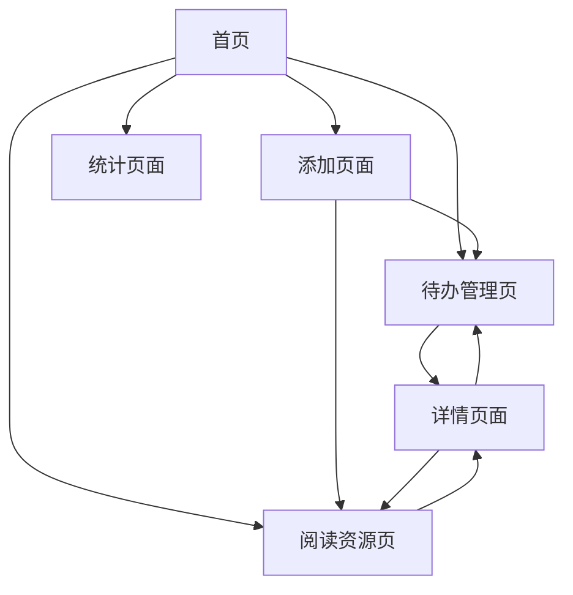

# 待办和阅读资源管理应用需求文档

## 1. Product Overview
一个集成的全栈应用，帮助用户高效管理日常待办事项和待阅读资源，提供统一的任务和知识管理平台。

该应用解决用户在工作和学习中分散管理任务和资源的痛点，通过直观的界面和智能分类功能，让用户能够集中管理所有待办事项和阅读材料。

目标是成为用户个人效率管理的核心工具，提升工作和学习效率。

## 2. Core Features

### 2.1 Feature Module
我们的待办和阅读资源管理应用包含以下主要页面：
1. **首页**：应用概览、快速添加入口、最近活动展示
2. **待办管理页**：待办事项列表、添加编辑、状态管理、优先级设置
3. **阅读资源页**：资源列表、分类管理、阅读状态跟踪
4. **添加页面**：统一的添加待办和资源入口，支持快速创建
5. **详情页面**：待办或资源的详细信息查看和编辑
6. **统计页面**：完成情况统计、阅读进度分析、效率报告

### 2.2 Page Details

| Page Name | Module Name | Feature description |
|-----------|-------------|---------------------|
| 首页 | 概览面板 | 显示待办事项总数、今日任务、未读资源数量等关键指标 |
| 首页 | 快速操作 | 提供快速添加待办和资源的按钮入口 |
| 首页 | 最近活动 | 展示最近添加的待办事项和阅读资源 |
| 待办管理页 | 任务列表 | 展示所有待办事项，支持按状态、优先级、日期筛选 |
| 待办管理页 | 状态管理 | 标记任务为待办、进行中、已完成状态 |
| 待办管理页 | 优先级设置 | 设置任务优先级（高、中、低），支持颜色标识 |
| 待办管理页 | 截止日期 | 设置和显示任务截止时间，过期提醒 |
| 阅读资源页 | 资源列表 | 展示所有阅读资源，支持按类型、状态分类查看 |
| 阅读资源页 | 分类管理 | 创建和管理资源分类标签（技术、生活、工作等） |
| 阅读资源页 | 阅读状态 | 标记资源为未读、阅读中、已读状态 |
| 阅读资源页 | 资源链接 | 存储和管理网页链接、文档路径等资源地址 |
| 添加页面 | 类型选择 | 选择添加待办事项或阅读资源 |
| 添加页面 | 表单填写 | 根据类型显示相应的表单字段进行信息录入 |
| 添加页面 | 快速保存 | 一键保存并返回相应列表页面 |
| 详情页面 | 信息展示 | 完整显示待办或资源的所有详细信息 |
| 详情页面 | 编辑功能 | 支持修改标题、描述、状态、标签等信息 |
| 详情页面 | 操作按钮 | 提供删除、复制、分享等操作功能 |
| 统计页面 | 完成统计 | 显示待办事项完成率、每日完成数量趋势 |
| 统计页面 | 阅读分析 | 展示阅读资源消费情况、分类分布统计 |
| 统计页面 | 效率报告 | 生成周报月报，分析个人效率变化趋势 |

## 3. Core Process

用户主要操作流程如下：

**待办事项管理流程：**
用户进入首页查看概览 → 点击待办管理或快速添加 → 创建新待办事项 → 设置优先级和截止日期 → 在列表中查看和管理 → 标记完成状态 → 查看统计报告

**阅读资源管理流程：**
用户进入首页 → 点击阅读资源页面 → 添加新的阅读资源 → 设置分类标签 → 标记阅读状态 → 通过链接访问资源 → 更新阅读进度

## 4. User Interface Design

### 4.1 Design Style
- **主色调**：#2563eb（蓝色）作为主色，#f8fafc（浅灰）作为背景色
- **辅助色**：#10b981（绿色）表示完成状态，#f59e0b（橙色）表示进行中，#ef4444（红色）表示高优先级
- **按钮样式**：圆角按钮设计，hover效果明显，支持阴影效果
- **字体**：系统默认字体，标题16-20px，正文14px，小字12px
- **布局风格**：卡片式布局，顶部导航栏，左侧可选菜单栏
- **图标风格**：使用简洁的线性图标，支持状态颜色变化

### 4.2 Page Design Overview

| Page Name | Module Name | UI Elements |
|-----------|-------------|-------------|
| 首页 | 概览面板 | 使用卡片布局展示统计数据，配色为浅蓝背景#f0f9ff，数字使用大字体显示 |
| 首页 | 快速操作 | 两个并排的圆角按钮，蓝色主色调，添加图标，hover时轻微放大效果 |
| 首页 | 最近活动 | 列表式布局，每项带有类型图标和时间戳，使用浅灰分割线 |
| 待办管理页 | 任务列表 | 卡片式列表，每个任务卡片包含标题、状态标签、优先级颜色条 |
| 待办管理页 | 筛选器 | 顶部横向标签页设计，支持多选，选中状态用主色调高亮 |
| 阅读资源页 | 资源列表 | 网格或列表切换视图，资源卡片显示封面、标题、分类标签 |
| 阅读资源页 | 分类标签 | 彩色标签设计，圆角矩形，不同分类使用不同颜色区分 |
| 添加页面 | 表单设计 | 简洁的表单布局，输入框使用边框设计，必填项标红星号 |
| 详情页面 | 信息展示 | 大标题+描述的层次化布局，操作按钮固定在底部 |
| 统计页面 | 图表展示 | 使用柱状图和饼图，配色与主题一致，支持交互式查看 |

### 4.3 Responsiveness
应用采用移动优先的响应式设计，支持桌面端和移动端自适应布局，针对触摸操作进行优化，按钮和链接区域足够大以便手指点击。